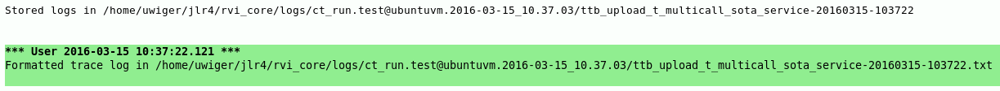
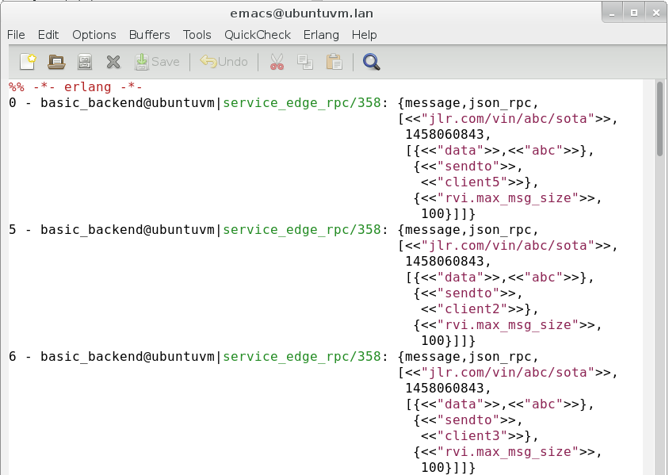
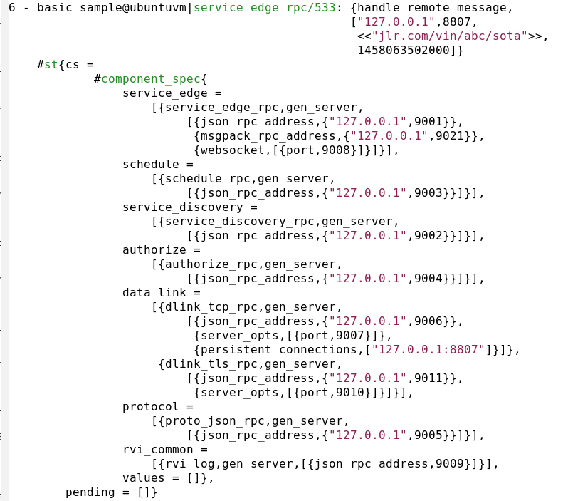

# trace_runner
A wrapper for tracing test runs and for complex shell-based tracing using TTB.

This component is based on [locks_ttb](https://github.com/uwiger/locks/blob/master/src/locks_ttb.erl), whose main purpose was to be used in complicated
multi-node test cases: a wrapper around the test case sets up a multi-node
trace using ttb; if the test case succeeds, the traces are discarded, but
if it fails, the logs are fetched, merged and formatted for 'easy' viewing.

The idea is complemented with the notion of using an `event()` function,
whose only purpose is to be traced. This can serve as extremely lightweight
runtime debugging statements. Since the `event()` function only returns
`ok`, the whole operation is cheaper than any runtime test for debug level
could be. The `include/trace_runner.hrl` include file defines `?event`
macros that can be used, including one that tests whether the `event()`
function is traced, before evaluating the argument expression. This can
be used to 'pretty-print' the arguments to the `event()` function without
incurring overhead when not tracing (obviously there is *some* overhead in
checking the trace status).

There is also support for shell-based tracing, making use of the
instrumentation callbacks e.g. for pretty-printing of trace output.

## API

The main API functions are:

```erlang
tr_ttb:on_nodes(Nodes, OutputFile, Spec) -> {ok, [{Item, MatchDesc}]}.
```

This function acts as a wrapper to [`ttb:start_trace/4`](https://www.erlang.org/doc/man/ttb.html#start_trace-4), and returns whatever
that call returns. The `Spec` can be either a module name, where the module
is expected to export some or all of the supported configuration callbacks
(see below), or a map():

```erlang
-type spec() :: #{ patterns => [tr_ttb:pattern()]
                 , flags    => {tr_ttb:procs(), tr_ttb:flags()},
                 , collect  => on_error | always
                 , info     => any() }
```

The `info` attribute is used for documentation purposes. If the trace
includes tracing on `tr_ttb:event/3`, a trace message will be included
showing `tr_ttb:event(_Line, ttb_started, Spec)`. The `tr_ct` trace
wrapper, described below, uses the `info` attribute to signal where,
at which checkpoint, the trace started.


Example (from https://github.com/PDXOstc/rvi_core, although at the time of writing, the trace_runner support hasn't yet been merged)

First, we create a callback module for the `tr_ttb` behavior, which
lets us specify trace patterns and trace flags.

```erlang
patterns() ->
    [{authorize_rpc        , event, 3, []},
     {service_edge_rpc     , event, 3, []},
     {service_discovery_rpc, event, 3, []},
     {dlink_tcp_rpc        , event, 3, []},
     {connection           , event, 3, []},
     {dlink_tls_rpc        , event, 3, []},
     {dlink_tls_conn       , event, 3, []},
     {dlink_bt_rpc         , event, 3, []},
     {bt_connection        , event, 3, []},
     {dlink_sms_rpc        , event, 3, []},
     {schedule_rpc         , event, 3, []},
     {proto_json_rpc       , event, 3, []},
     {proto_msgpack_rpc    , event, 3, []},
     {rvi_common           , event, 3, []},
     {?MODULE              , event, 3, []}
     | tr_ttb:default_patterns()].

flags() ->
    {all, call}.
```

Then, we instrument our test suite(s):

```erlang
t_multicall_sota_service(Config) ->
    with_trace(fun t_multicall_sota_service_/1, Config,
     	       "t_multicall_sota_service").

t_multicall_sota_service_(_Config) ->
    %% the actual test case
    Data = <<"abc">>,
    ...
```

## Common Test wrapper

The module `tr_ct` contains a wrapper function, `tr_ct:with_trace/3`,
which calls the above `tr_ttb:on_nodes/3` at a chosen time, applies
a test function, and fetches and pretty-prints the trace data if the
test function fails. Note that if `collect => always`, fetching and 
pretty-printing will happen even if the test case succeeds.

Example, from [the mnesia_rocksdb project](https://github.com/aeternity/mnesia_rocksdb/blob/master/test/mnesia_rocksdb_SUITE.erl)

```erlang
mrdb_two_procs(Config) ->
    tr_ct:with_trace(fun mrdb_two_procs_/1, Config,
                     tr_flags(
                       {self(), [call, sos, p]},
                       tr_patterns(
                         mrdb, [ {mrdb, insert, 2, x}
                               , {mrdb, read, 2, x}
                               , {mrdb, activity, x} ], tr_opts()))).

mrdb_two_procs_(Config) ->
    ....

tr_opts() ->
    #{patterns => [ {mrdb, '_', '_', x}
                  , {mrdb_lib, '_', '_', x}
                  , {tr_ttb, event, 3, []}
                  , {?MODULE, go_ahead_other, 3, x}
                  , {?MODULE, wait_for_other, 3, x}
                  , {?MODULE, await_other_down, 3, x}
                  , {?MODULE, do_when_p_allows, 4, x}
                  , {?MODULE, allow_p, 3, x}
                  ]}.

tr_patterns(Mod, Ps, #{patterns := Pats} = Opts) ->
    Pats1 = [P || P <- Pats, element(1,P) =/= Mod],
    Opts#{patterns => Ps ++ Pats1}.

tr_flags(Flags, Opts) when is_map(Opts) ->
    Opts#{flags => Flags}.
```

The `with_trace/3` wrapper will derive the output filename from the
Common Test `Config`: either via the property `destination`, or via
the test case name, taken from the `tc_logfile` property maintained
by the Common Test support logic. In the latter case, a `".tr_ct"`
suffix is added to the test case name.


In the wrapper, we determine which nodes to include in the trace,
give the trace a name, then call the test case within a try ... catch.
If the test succeeds, we call `stop_nofetch()`, discarding the trace,
otherwise, we fetch the trace logs and merge them, pretty-printing
the result.

```erlang
with_trace(F, Config, File) ->
    Nodes = [N || {N,_} <- get_nodes()],
    rvi_ttb:on_nodes([node()|Nodes], File),
    try F(Config)
    catch
	error:R ->
	    Stack = erlang:get_stacktrace(),
	    ttb_stop(),
	    ct:log("Error ~p; Stack = ~p", [R, Stack]),
	    erlang:error(R);
	exit:R ->
	    ttb_stop(),
	    exit(R)
    end,
    rvi_ttb:stop_nofetch(),
    ok.

ttb_stop() ->
    Dir = rvi_ttb:stop(),
    Out = filename:join(filename:dirname(Dir),
			filename:basename(Dir) ++ ".txt"),
    rvi_ttb:format(Dir, Out),
    ct:log("Formatted trace log in ~s~n", [Out]).
```

On test failure, this would result in the following output in the CT log:



The formatted text log has an emacs erlang-mode header, so is best
viewed in emacs.



Note that the log formatter prefixes each message with the relative time
(in ms) since the start of the trace, the name of the node where the
trace event originated and the module/line of the traced call.
It also tries to pretty-print records, looking for a
`record_fields(RecName)` callback in the module named in the call trace.



A `record_fields/1` function might look like this:

```erlang
record_fields(service_entry)	-> record_info(fields, service_entry);
record_fields(st           )	-> record_info(fields, st);
record_fields(component_spec)	-> record_info(fields, component_spec);
record_fields(_)		-> no.
```

### Tracing checkpoints

For some test cases, it may be useful to defer tracing start until the point
where tricky stuff starts happening. This can be done with the functions
`tr_ct:set_activation_checkpoint(Label, Config)`, and
`tr_ct:trace_checkpoint(Label, Config)`.

**Example:**
```erlang
init_per_suite(Config) ->
    tr_ct:set_activation_checkpoint(?TABS_CREATED, Config).

...

encoding_sext_attrs(Config) ->
    tr_ct:with_trace(fun encoding_sext_attrs_/1, Config,
                     tr_patterns(mnesia_rocksdb,
                                 [{mnesia_rocksdb,'_',x}], tr_opts())).

encoding_sext_attrs_(Config) ->
    Created = create_tabs([{t, [{attributes, [k, v]}]}], Config),
    ok = mrdb:insert(t, {t, 1, a}),
    ok = mnesia:dirty_write({t, 2, b}),
    expect_error(fun() -> mrdb:insert(t, {t, a}) end, ?LINE,
                 error, {mrdb_abort, badarg}),
    expect_error(fun() -> mnesia:dirty_write({t, a}) end, ?LINE,
                 exit, '_'),
    delete_tabs(Created),
    ok.

...

create_tabs(Tabs, Config) ->
    Res = lists:map(fun create_tab/1, Tabs),
    tr_ct:trace_checkpoint(?TABS_CREATED, Config),
    Res.
```

The above test setup will cause tracing to start only after `create_tabs/2`
has been completed.

## Custom formatting of terms

The pretty-printer allows terms to be custom-formatted using a `pp_term(Term)` callback,
optionally exported from the callback module. The semantics of the callback is:

```erlang
pp_term(Term) -> {yes, Term1} | no.
```

The custom formatting function can call on subsequent `pp_term/1` callbacks using
the `trace_runner` helper function `tr_ttb:pp_term(Term, Mod) -> Term1`.
The helper unwraps any `{yes, ...}` tuples etc., returning either a modified term
or the original term.

Instead of a callback module, `tr_ttb:pp_term/2` can take a fun as second argument.
Technically, the implementation is:

```erlang
pp_term(T, M) when is_atom(M) ->
    pp_term(T, fun M:pp_term/1);
pp_term(T, F) when is_function(F, 1) ->
    try F(T) of
        {yes, Out} ->
            Out;
        no         -> pp_term_(T, F)
    catch
        error:_ ->
            pp_term_(T, F)
    end.
```

... where `pp_term_/2` traverses the term, looking for opportunities to pretty-print
sub-terms. That is, by returning `no`, the callback allows the traversal to continue.
If it is known that no opportunities to pretty-print exist in a subterm, returning
`{yes, Term}` will stop further inspection in that area.

As an example of how layered pretty-printing can be leveraged, see the pretty-printing
of Merkle Patricia Trees (MPT) in the Aeternity system. MPTs are particularly hard
to read in raw form, partly since terms are encoded twice. The `pp_term/1` callbacks
at the application level therefore first call on a generic helper function, which
converts a tree to a key-value list, then applies application-specific decoding of
the stored terms. Note the trick to tag custom-formatted terms with `'$...'` tags,
both to help the reader and to allow higher levels to detect and further refine
the data.

```erlang
record_fields(_) -> {check_mods, [ aec_accounts ]}.

pp_term(Term) ->
    aeu_mp_trees:tree_pp_term(Term, '$accounts', fun aec_accounts:deserialize/2).
```

The helper function:
```erlang
%% Utility trace support for state tree modules
%%
tree_pp_term(#mpt{} = Term, CacheTag, XForm) ->
    Dec = fun(X) -> pp_mpt_decode(X, CacheTag, XForm) end,
    {yes, tr_ttb:pp_term(tr_ttb:pp_term(Term, aeu_mtrees), Dec)};
tree_pp_term(_, _, _) ->
    no.

pp_mpt_decode({'$mpt', L}, Tag, XForm) ->
    {yes, {Tag, [{K, XForm(K, V)}
                 || {K, V} <- L]}};
pp_mpt_decode(_, _, _) ->
    no.
```

## Record pretty-printing

The pretty-printer uses a generalized version of the `record_print_fun` used in
`io_lib_pretty.erl`. This way, `record_fields(Term)` can be exported from the
callback module. In addition to the normal `{yes, FieldNames} | no` returns,
the callbacks can also return `{check_mods, Modules}`, instructing the caller
to inspect any `record_fields/1` callbacks of the listed modules.

## Shell tracing

Shell tracing can make use of the same instrumented pretty-printing via the
function `tr_ttb:dbg_tracer(Options)` function. This starts a `dbg` tracer
which calls on the pretty-printing callbacks described above. As formatting
is likely to be slower, it is recommended that tracing is stopped using the
function `tr_ttb:dbg_stop()`, which waits until the tracer process has processed
queued trace messages before stopping it.

The optional `Options` argument is a map, and supports the following options:
```
fd           - the output descriptor. Defaults to the group_leader of the current process
print_header - whether to print the preamble mainly meant for emacs. Defaults to 'false'
limit        - How many lines of trace output to print. Defaults to 'infinity'
time_resolution - millisecond | microsecond. Defaults to 'millisecond'
delay        - The trace handler will sleep for the given number of milliseconds
shell_records - If possible, records definitions stored in the shell via `rr(Mod)` will be used
```

The `delay` option, e.g. `delay => 1000` causes a sleep when encountered. The option is then removed
from the accumulator. A callback could then reinsert it for another sleep, although currently, there is
no provision for user modification of the accumulator state.

In the future, more log formatting options may be added.
Pull requests are welcome.

## Extended trace patterns

If `Patterns` is given as a list, all patterns will be applied as in `ttb:start_trace/4`.
`tr_ttb` also supports an extended description:

```erlang
PatternMap :: #{ start := [tuple()]
               , tp   => [{M, F, A, MatchSpec}]
               , tpl  => [{M, F, A, MatchSpec}]
               , tpe  => [{Event, MatchSpec}]
               , ctp  => [{M, F, A}]
               , ctpl => [{M, F, A}]
               , ctpg => [{M, F, A}]
               , ctpe => [Event] }.
```

When this form is used, the `start` element (mandatory) is passed to `ttb:start_trace/4`,
and then, the corresponding functions, `ttb:tp/2, ttb:tpl/2, ...` are called for those
other elements that are present. Note that all the other elements are optional.

This allows the caller to e.g conveniently set a wildcard trace pattern for a whole module,
then selectively turn of trace on a few specific functions in that module.
